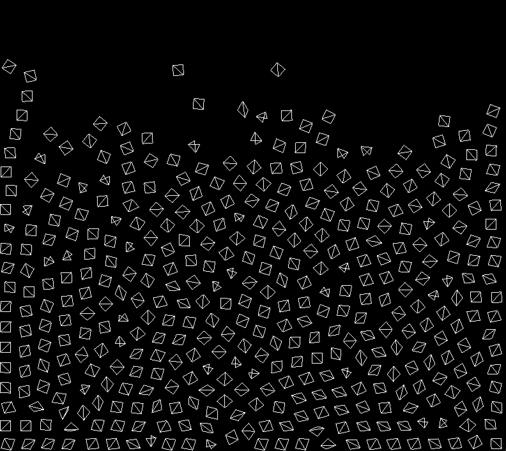
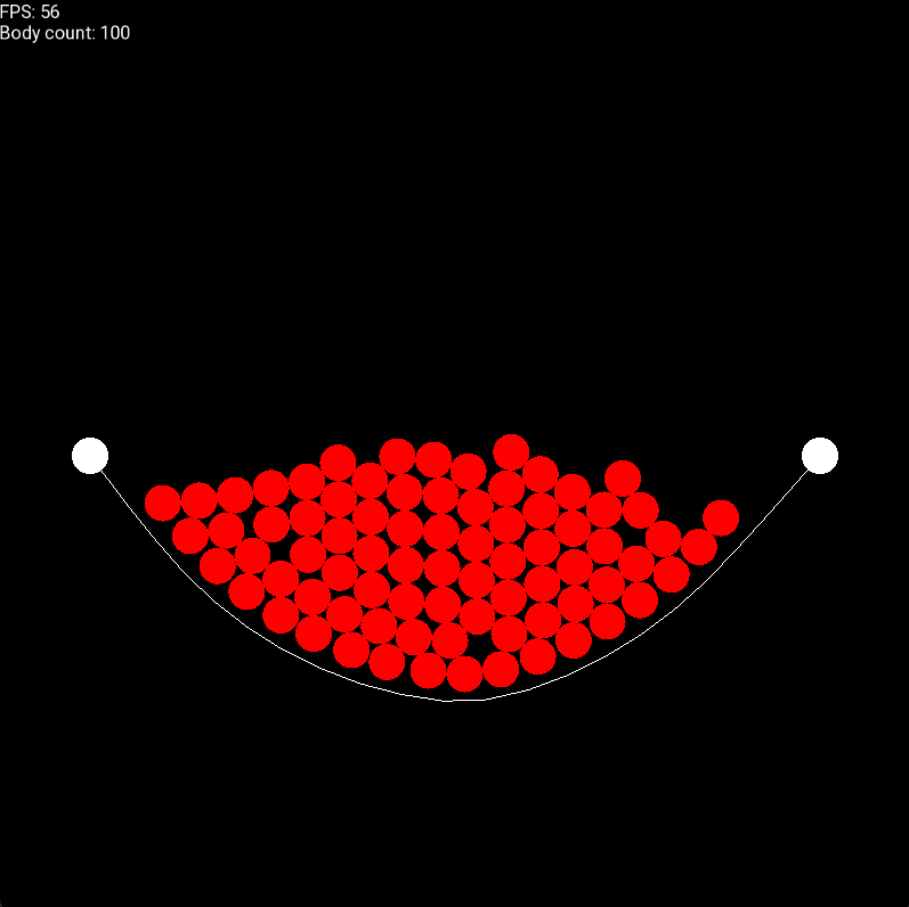
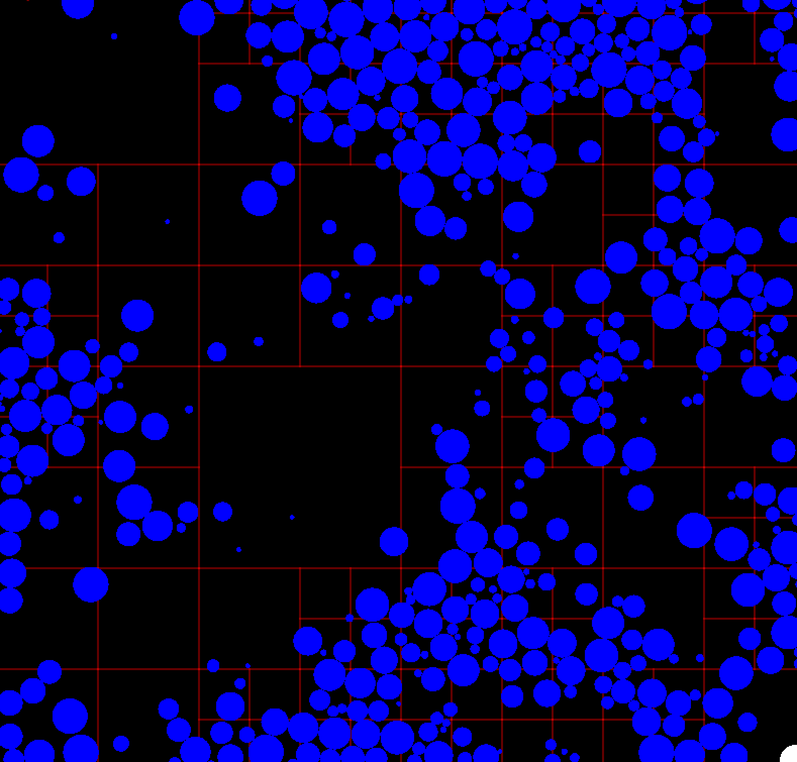
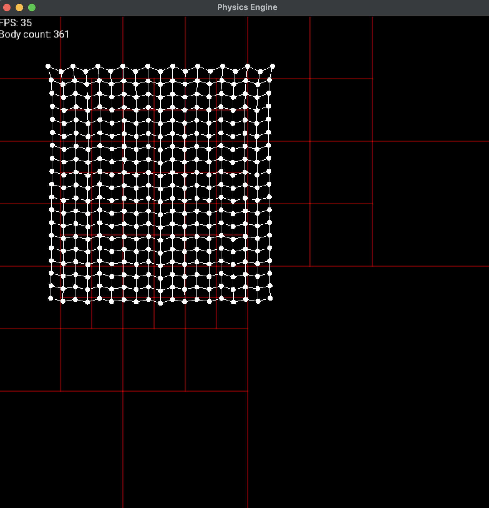

<br />
<div align="center">
  <a href="https://github.com/othneildrew/Best-README-Template">
    
  </a>

  <h3 align="center">Verlet Physics Simulator</h3>
</div>


<!-- TABLE OF CONTENTS -->
<details>
  <summary>Table of Contents</summary>
  <ol>
    <li>
      <a href="#about-the-project">About The Project</a>
    </li>
    <li>
      <a href="#getting-started">Getting Started</a>
      <ul>
        <li><a href="#prerequisites">Prerequisites</a></li>
        <li><a href="#installation">Installation</a></li>
      </ul>
    </li>
    <li><a href="#roadmap">Roadmap</a></li>
    <li><a href="#contributing">Contributing</a></li>
    <li><a href="#license">License</a></li>
    <li><a href="#contact">Contact</a></li>
  </ol>
</details>


<!-- ABOUT THE PROJECT -->
## About The Project






I love high performance computing so I chose to build physics engine using C++. The project touched various algorithms with many pros and cons. I also get a chance to write multithreading to improve performance. Below is the algorithms I have implemented so far for collision detection.

Collision handler algorithms

- Naive O(n^2)
- Sorting O(n * log(n))
- Grid O(n * m)


<!-- GETTING STARTED -->
## Getting Started

This is an example of how you may give instructions on setting up your project locally.
To get a local copy up and running follow these simple example steps.

### Prerequisites

This is an example of how to list things you need to use the software and how to install them.
* Mac
  ```sh
  brew install sfml
  ```
* Linux
  ```sh
  sudo apt install g++ libsfml-dev
  ```

### Installation

Below is an example of how you can instruct your audience on installing and setting up your app. 
1. Create build directory
   ```sh
   mkdir build && cd build
   ```
2. use Cmake to generate makefiles and run
   ```sh
   cmake ../ && make
   ```
3. Run the application
   ```js
   ./main
   ```

<p align="right">(<a href="#readme-top">back to top</a>)</p>


<!-- ROADMAP -->
## Roadmap

- [x] Circle Collision
- [x] Multithreading
- [x] Chain
- [x] Force
- [x] More shapes using circles
- [x] Quad Tree Optimization
- [ ] Trusses
- [ ] Soft Body
- [x] Cloth

See the [open issues](https://github.com/othneildrew/Best-README-Template/issues) for a full list of proposed features (and known issues).


<!-- CONTRIBUTING -->
## Contributing

Contributions are what make the open source community such an amazing place to learn, inspire, and create. Any contributions you make are **greatly appreciated**.

If you have a suggestion that would make this better, please fork the repo and create a pull request. You can also simply open an issue with the tag "enhancement".
Don't forget to give the project a star! Thanks again!

1. Fork the Project
2. Create your Feature Branch (`git checkout -b feature/AmazingFeature`)
3. Commit your Changes (`git commit -m 'Add some AmazingFeature'`)
4. Push to the Branch (`git push origin feature/AmazingFeature`)
5. Open a Pull Request


<!-- LICENSE -->
## License

Distributed under the MIT License. See `LICENSE.txt` for more information.


<!-- CONTACT -->
## Contact

Dorjderem Namsraijav - dorjderemdorj202@gmail.com

Project Link: [https://github.com/Dorjderem2002/verlet-physics-engine](https://github.com/Dorjderem2002/verlet-physics-engine)


[license-shield]: https://img.shields.io/github/license/othneildrew/Best-README-Template.svg?style=for-the-badge
[license-url]: https://github.com/othneildrew/Best-README-Template/blob/master/LICENSE.txt